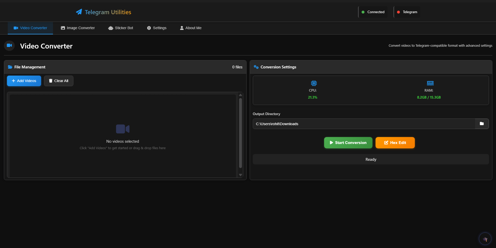
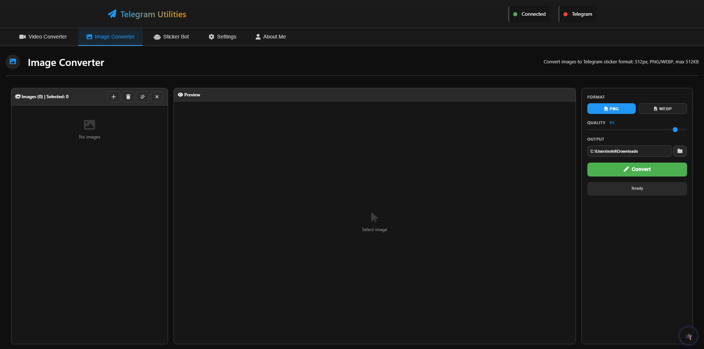
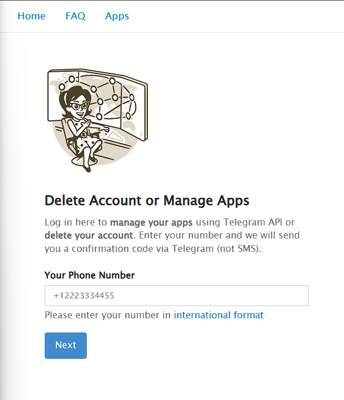
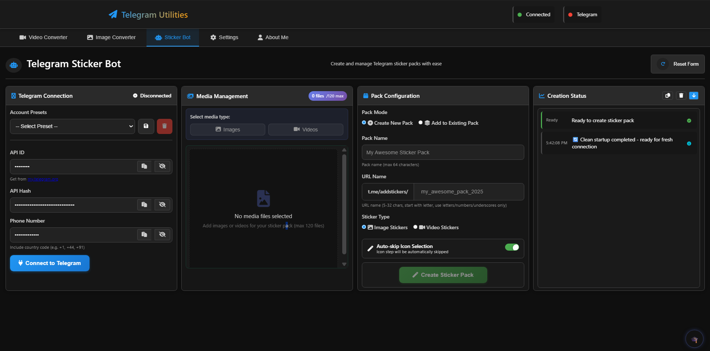
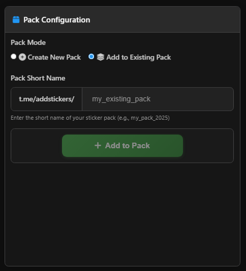
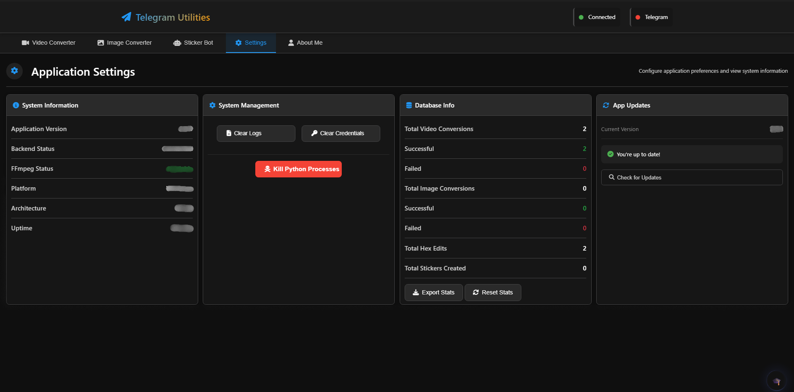

<div align="center">

# Telegram Sticker Maker & Auto Uploader

### A powerful desktop application for creating and uploading Telegram sticker packs with ease

[](https://www.electronjs.org/)
[](https://www.python.org/)
[](https://nodejs.org/)
[](https://docs.telethon.dev/)
[](https://ffmpeg.org/)
[](https://imagemagick.org/)
[](LICENSE.txt)

<br/>

**Convert videos & images to Create sticker packs to Upload directly to Telegram**

*No bot commands. No manual uploads. Just drag, drop, and done.*

<br/>

[Download Latest Release](https://github.com/RohitPoul/Telegram-Sticker-Maker-And-Auto-Uploader/releases/latest) | [Report Bug](https://github.com/RohitPoul/Telegram-Sticker-Maker-And-Auto-Uploader/issues) | [Request Feature](https://github.com/RohitPoul/Telegram-Sticker-Maker-And-Auto-Uploader/issues)

</div>

---

## Table of Contents

- [App Users](#app-users)
- [For Developers](#for-developers)
- [Additional Info](#additional-info)

---

# App Users

## Table of Contents

1. [Media Converters](#1-media-converters)
   - [Video Converter](#video-converter)
   - [Hex Edit](#hex-edit)
   - [Image Converter](#image-converter)
2. [Sticker Pack Creation Automation](#2-sticker-pack-creation-automation)
   - [Requirements (API Credentials)](#requirements-api-credentials)
   - [How to Use Sticker Bot](#how-to-use-sticker-bot)
   - [Create New Pack](#create-new-pack)
   - [Add to Existing Pack](#add-to-existing-pack)
   - [Creation Status](#creation-status)
3. [Settings](#3-settings)
4. [About Me & Contact](#4-about-me--contact)
5. [Error Handling & Reporting](#5-error-handling--reporting)

---

## 1. Media Converters

The app provides powerful media conversion tools to prepare your videos and images for Telegram stickers. Telegram has strict requirements for sticker formats, and these converters handle all the technical details for you automatically.

Both converters support batch processing, so you can convert multiple files at once. Just add your files, select an output folder, and hit convert.

---

### Video Converter

Converts video files to **WebM** format - the required format for Telegram video stickers.

**Supported input formats:** MP4, AVI, MOV, MKV, FLV, WebM, GIF

**Output specifications:**


| Property | Value |
|----------|-------|
| Format | WebM (VP9 codec) |
| Resolution | 512x512 pixels (auto-scaled, aspect ratio preserved) |
| Duration | Up to 15 seconds (recommended: under 8 seconds) |
| File size | Optimized to stay under 256KB |

**How to use:**

1. Click "Add Videos" or drag and drop your video files
2. Select an output directory
3. Click "Start Conversion"
4. Wait for the progress bar to complete

<div align="center">
  
</div>

---

### Hex Edit

A quick fix for videos that are over Telegram's 3-second duration limit. Instead of re-encoding the entire video, Hex Edit modifies the file metadata to change the reported duration while keeping the actual video intact.

**When to use:**

| Scenario | Use Hex Edit? |
|----------|---------------|
| Video is over 3 seconds but you want to keep full length | Yes |
| Video plays fine but Telegram rejects it for duration | Yes |
| Video needs actual trimming or re-encoding | No, use Video Converter instead |

**How to use:**

1. Add your WebM video files that are slightly over the size limit
2. Select an output directory
3. Click "Hex Edit"
4. The modified files will be saved to your output folder

<!-- Screenshot placeholder: Add hex edit screenshot here -->
<!--  -->

---

### Image Converter

Converts image files to **PNG** or **WEBP** format - the required formats for Telegram static stickers.

**Supported input formats:** PNG, JPG, JPEG, WEBP, BMP, GIF, TIFF

**Output specifications:**

| Property | Value |
|----------|-------|
| Format | PNG or WEBP (your choice) |
| Resolution | 512x512 pixels (auto-scaled, aspect ratio preserved) |
| File size | Optimized to stay under 512KB |
| Quality | Adjustable (50-100%) |

**How to use:**

1. Click "Add Images" or drag and drop your image files
2. Click on any image to preview it (you can zoom and pan in the preview)
3. Select output format (PNG or WEBP)
4. Adjust quality if needed
5. Select an output directory
6. Click "Convert"

<div align="center">
  
</div>

---

## 2. Sticker Pack Creation Automation

The Sticker Bot lets you create and manage Telegram sticker packs directly from the app. No need to chat with @Stickers bot manually - just connect your Telegram account, add your media, and the app handles everything automatically.

---

### Requirements (API Credentials)

To use the Sticker Bot, you need your Telegram API credentials. These are free and take 2 minutes to get.

**How to get your API ID and API Hash:**

1. Open your browser and go to [my.telegram.org](https://my.telegram.org)
2. Enter your phone number (with country code, like +1234567890) and click "Next"
3. Telegram will send a code to your Telegram app - enter that code
4. Click on "API development tools"
5. Fill in the form:

| Field | What to enter |
|-------|---------------|
| App title | Anything (e.g., "My Sticker App") |
| Short name | Anything, letters only (e.g., "mystickerapp") |
| Platform | Select "Desktop" |
| Description | Leave empty or write anything |

<div align="center">
  
</div>

6. Click "Create application"
7. Copy your **API ID** (a number) and **API Hash** (a long string)

**Important:**
- Never share these credentials with anyone
- You only need to do this once
- If you lose them, log back into my.telegram.org to see them again

---

### How to Use Sticker Bot

Once you have your API credentials, here's how to connect and start creating sticker packs.

**Connecting to Telegram:**

1. Go to the "Sticker Bot" tab
2. Enter your API ID, API Hash, and phone number (with country code)
3. Click "Connect to Telegram"
4. Enter the verification code sent to your Telegram app
5. If you have 2FA enabled, enter your cloud password

**Account Presets:**

You can save your credentials as presets for quick switching between accounts:
- Click the save icon to store current credentials
- Use the dropdown to switch between saved accounts
- Delete presets you no longer need

<div align="center">
  
</div>

---

### Create New Pack

**How to create a new sticker pack:**

1. Connect to Telegram (see above)
2. Select "Create New Pack" mode
3. Choose media type: Images or Videos
4. Click "Add Images" or "Add Videos" to add your converted stickers
5. Assign emojis to each sticker (click the emoji field next to each file)
6. Fill in pack details:

| Field | Description |
|-------|-------------|
| Pack Name | Display name of your pack (max 64 characters) |
| URL Name | Short name for the link `t.me/addstickers/YOUR_URL_NAME` (5-32 characters, letters/numbers/underscores only) |
| Sticker Type | Image Stickers or Video Stickers |

7. Click "Create Sticker Pack"
8. Wait for the process to complete

**Tips:**
- Maximum 120 stickers per pack
- URL name must start with a letter
- If URL name is taken, you'll get 3 retry attempts with suggestions

<!-- Screenshot placeholder: Add create pack screenshot here -->
<!--  -->

---

### Add to Existing Pack

**How to add stickers to an existing pack:**

1. Connect to Telegram
2. Select "Add to Existing Pack" mode
3. Enter the pack's short name (the part after `t.me/addstickers/`)
4. Add your media files
5. Assign emojis to each sticker
6. Click "Add to Pack"

**Note:** You can only add stickers to packs you own.

<div align="center">
  
</div>

---

### Creation Status

The Creation Status panel shows real-time progress of your sticker pack creation:

| Status | Meaning |
|--------|---------|
| Ready | Waiting to start |
| Processing | Currently uploading stickers |
| Completed | Successfully finished |
| Error | Something went wrong (check the message) |

**Features:**
- Live progress updates for each sticker
- Copy log button to save the full log
- Clear history to reset the status panel
- Auto-scroll toggle to follow progress

<!-- Screenshot placeholder: Add creation status screenshot here -->
<!--  -->

---

## 3. Settings

The Settings tab provides system information and management tools.

**System Information:**

| Info | Description |
|------|-------------|
| Application Version | Current app version |
| Backend Status | Python backend connection status |
| FFmpeg Status | Whether FFmpeg is available |
| Platform | Your operating system |
| Architecture | 32-bit or 64-bit |
| Uptime | How long the app has been running |

**Database Info:**

Track your conversion statistics:
- Total video conversions (successful/failed)
- Total image conversions (successful/failed)
- Total hex edits
- Total stickers created

**Management Tools:**

| Button | What it does |
|--------|--------------|
| Clear Logs | Delete application log files |
| Clear Credentials | Remove saved Telegram credentials |
| Kill Python Processes | Force stop stuck backend processes |
| Export Stats | Save your statistics to a file |
| Reset Stats | Clear all statistics |

<div align="center">
  
</div>

---

## 4. About Me & Contact

Hi! I'm Rohit, the developer behind this app. I'm passionate about creating useful tools and open source projects.

**🟢 Available for Hire** - Open to freelance work, collaborations, and job opportunities!

**Connect with me:**

| Platform | Link |
|----------|------|
| GitHub | [@RohitPoul](https://github.com/RohitPoul) |
| Email | [poulrohit258@gmail.com](mailto:poulrohit258@gmail.com) |
| Telegram Group | [Join Community](https://t.me/+QeqFm1Mq0ediOTJl) |

**Support My Work:**

If you find this app useful, consider supporting me:

| Platform | Link |
|----------|------|
| GitHub Sponsors | [Sponsor Me](https://github.com/sponsors/Rohitpoul) |

**Other Projects:**
- [Background Remover AI](https://github.com/RohitPoul/Background-Remover-Ai)

Open to collaboration, feedback, and new opportunities. Feel free to reach out!

---

## 5. Error Handling & Reporting

**Common Issues and Solutions:**

| Issue | Solution |
|-------|----------|
| Backend not connecting | Restart the app, or use "Kill Python Processes" in Settings |
| FFmpeg not found | The app bundles FFmpeg - try reinstalling |
| Telegram code invalid | Wait a moment and try again, respect rate limits |
| 2FA password wrong | Enter your Telegram cloud password, not phone passcode |
| URL name taken | Use the retry dialog to pick a different name |
| Pack creation stuck | Check if Telegram sent any messages to your account |
| Conversion fails | Check if the input file is corrupted or unsupported |

**How to Report Bugs:**

1. Go to [GitHub Issues](https://github.com/RohitPoul/Telegram-Sticker-Maker-And-Auto-Uploader/issues)
2. Click "New Issue"
3. Include:
   - What you were trying to do
   - What happened instead
   - Screenshots if possible
   - Your operating system

---

# For Developers

This section is for developers who want to run the app from source code or contribute to the project.

## Development Setup

**Prerequisites:**

| Requirement | Version |
|-------------|---------|
| Node.js | 18+ |
| Python | 3.8+ |
| FFmpeg | Latest |
| ImageMagick | Latest |

**Installation:**

1. Clone the repository:
```bash
git clone https://github.com/RohitPoul/Telegram-Sticker-Maker-And-Auto-Uploader.git
cd Telegram-Sticker-Maker-And-Auto-Uploader
```

2. Install Node.js dependencies:
```bash
npm install
```

3. Install Python dependencies:
```bash
cd python
pip install -r requirements.txt
cd ..
```

4. Install system dependencies (FFmpeg & ImageMagick):

| OS | Command |
|----|---------|
| Windows | `choco install ffmpeg imagemagick` |
| macOS | `brew install ffmpeg imagemagick` |
| Linux | `sudo apt install ffmpeg imagemagick` |

5. Run the app:
```bash
npm start
```

---

## Configuration

**Environment Variables:**

| Variable | Description | Default |
|----------|-------------|---------|
| `ENABLE_GPU` | Enable GPU acceleration | `0` |
| `ELECTRON_DEVTOOLS` | Open DevTools on launch | `0` |
| `BACKEND_LOG_LEVEL` | Log level: INFO/WARNING/ERROR | `WARNING` |

**Example:**
```bash
ELECTRON_DEVTOOLS=1 npm start
```

---

## Project Structure

```
├── electron/
│   ├── main.js                 # Electron main process
│   ├── preload.js              # IPC bridge
│   ├── splash.html             # Loading screen
│   └── renderer/               # Frontend (HTML/CSS/JS)
│       ├── index.html
│       ├── script.js
│       ├── styles.css
│       ├── image-handler.js
│       └── modules/
├── python/
│   ├── backend.py              # Flask API server
│   ├── video_converter.py      # Video processing
│   ├── image_processor.py      # Image processing
│   ├── sticker_bot.py          # Telegram sticker automation
│   └── requirements.txt
├── runtime/                    # Bundled dependencies (for builds)
│   ├── ffmpeg/
│   ├── imagemagick/
│   └── python/
├── screenshots/                # README screenshots
└── package.json
```

---

## Building the App

**Prepare runtime dependencies:**
```bash
npm run prepare-runtime
```
This downloads Python, FFmpeg, and ImageMagick for bundling.

**Build the installer:**
```bash
npm run build:windows
```

**Build and publish to GitHub Releases:**
```bash
# Set your GitHub token first
$env:GH_TOKEN = "your_github_token"

# Build and publish
npx electron-builder --win --publish always
```

**Build outputs:**
- `dist/Telegram Utilities Setup X.X.X.exe` - Installer
- `dist/win-unpacked/` - Portable version

---

# Additional Info

## Telegram Sticker Limits

| Type | Limit |
|------|-------|
| Stickers per pack | 120 max |
| Video sticker size | 512x512 pixels |
| Video sticker duration | Up to 3 seconds (officially) |
| Video sticker format | WebM (VP9) |
| Video sticker file size | 256KB max |
| Image sticker size | 512x512 pixels (one side must be exactly 512) |
| Image sticker format | PNG or WEBP |
| Image sticker file size | 512KB max |
| Pack icon | 100x100 pixels, WebM, under 32KB |

---

## License

All rights reserved. Contact the author for usage permissions.

See [LICENSE.txt](LICENSE.txt) for details.

---

