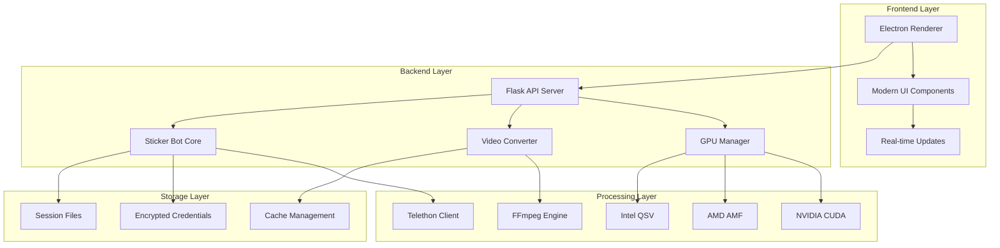

# 🎨 Complete Sticker - Advanced Telegram Sticker Creator

<div align="center">


**Professional-grade desktop application for creating, managing, and publishing Telegram sticker packs with advanced automation and GPU acceleration.**

[](https://python.org)
[](https://electronjs.org)
[](https://ffmpeg.org)
[](https://telethon.readthedocs.io)

[](LICENSE)
[](https://github.com/yourusername/complete-sticker)
[](https://github.com/yourusername/complete-sticker/releases)

</div>

---

## 🚀 **Overview**

Complete Sticker is a cutting-edge desktop application that revolutionizes the creation and management of Telegram sticker packs. Built with enterprise-grade architecture, it combines the power of Electron's modern UI with Python's robust backend processing, delivering a seamless experience for content creators, businesses, and developers.

### ✨ **Key Features**

<table>
<tr>
<td width="50%">

#### 🎯 **Advanced Media Processing**
- **GPU-Accelerated Conversion**: NVIDIA CUDA, AMD AMF, Intel QSV support
- **Intelligent Fallback**: Automatic CPU processing when GPU unavailable
- **Batch Processing**: Handle hundreds of files with progress tracking
- **Format Optimization**: WebM (VP9) with 512×512 padding, ~254KB target
- **Hex Editing**: Advanced binary manipulation for edge cases

</td>
<td width="50%">

#### 🤖 **Telegram Automation**
- **Secure Authentication**: Phone, SMS code, and 2FA support
- **Session Management**: Persistent connections with automatic reconnection
- **Pack Creation**: Automated sticker pack creation and management
- **Emoji Mapping**: Advanced emoji assignment with bulk operations
- **Publishing**: One-click pack publication to Telegram

</td>
</tr>
<tr>
<td width="50%">

#### 🖥️ **Modern User Interface**
- **Responsive Design**: Adaptive layout for all screen sizes
- **Real-time Monitoring**: Live system stats and progress tracking
- **Drag & Drop**: Intuitive file management
- **Theme Support**: Dark/light mode with custom themes
- **Accessibility**: Full keyboard navigation and screen reader support

</td>
<td width="50%">

#### 🔒 **Enterprise Security**
- **Encrypted Storage**: AES-256 encryption for sensitive data
- **Secure Credentials**: Never stores plaintext API keys
- **Session Isolation**: Separate sessions for different accounts
- **Audit Logging**: Comprehensive activity tracking
- **Privacy First**: No data collection or telemetry

</td>
</tr>
</table>

---

## 🏗️ **Architecture**



---

## 🛠️ **Technology Stack**

### **Frontend**
- **Electron** - Cross-platform desktop framework
- **Modern JavaScript (ES2023)** - Latest language features
- **CSS Grid & Flexbox** - Responsive layouts
- **Web APIs** - Clipboard, file system, notifications

### **Backend**
- **Python 3.12+** - Core processing engine
- **Flask** - RESTful API framework
- **Telethon** - Asynchronous Telegram client
- **FFmpeg** - Media processing powerhouse
- **psutil** - System monitoring and optimization

### **Acceleration**
- **NVIDIA CUDA** - GPU-accelerated video processing
- **AMD AMF** - Advanced Media Framework support
- **Intel QSV** - Quick Sync Video acceleration
- **Multi-threading** - Parallel processing optimization

---

## 📦 **Installation**

### **Prerequisites**

```bash
# System Requirements
- Python 3.12 or higher
- Node.js 18+ and npm
- FFmpeg with GPU support (optional but recommended)
- 4GB RAM minimum, 8GB recommended
- 2GB free disk space
```

### **Quick Start**

```bash
# Clone the repository
git clone https://github.com/yourusername/complete-sticker.git
cd complete-sticker

# Install Python dependencies
pip install -r python/requirements.txt

# Install Node.js dependencies
npm install

# Start the application
npm start
```

### **Advanced Installation**

<details>
<summary><strong>🔧 GPU Acceleration Setup</strong></summary>

#### **NVIDIA CUDA**
```bash
# Windows (using winget)
winget install NVIDIA.CUDA

# Verify installation
nvidia-smi
nvcc --version
```

#### **AMD AMF**
```bash
# Install AMD drivers with AMF support
# Download from: https://www.amd.com/support
```

#### **Intel QSV**
```bash
# Install Intel Graphics drivers
# Download from: https://www.intel.com/content/www/us/en/support/articles/000005629/graphics.html
```

</details>

---

## 🎮 **Usage**

### **Basic Workflow**

1. **Launch Application**
   ```bash
   npm start
   ```

2. **Configure Telegram**
   - Enter API credentials from [my.telegram.org](https://my.telegram.org)
   - Authenticate with phone number and verification code

3. **Add Media Files**
   - Drag & drop images/videos
   - Batch select multiple files
   - Automatic format detection and optimization

4. **Create Sticker Pack**
   - Set pack name and description
   - Assign emojis to stickers
   - Configure pack settings

5. **Publish**
   - Review and preview
   - One-click publication
   - Automatic pack sharing

### **Advanced Features**

<details>
<summary><strong>🎨 Mass Emoji Assignment</strong></summary>

```javascript
// Advanced emoji assignment options
- Random emoji distribution
- Category-based selection
- Pattern-based assignment
- Sequential emoji rotation
- Custom emoji collections
```

</details>

<details>
<summary><strong>⚡ GPU Acceleration</strong></summary>

```python
# Automatic GPU detection and optimization
- Real-time GPU monitoring
- Dynamic load balancing
- Fallback to CPU processing
- Performance metrics tracking
```

</details>

---

## 📊 **Performance Metrics**

| Feature | Performance | Optimization |
|---------|-------------|--------------|
| **Video Conversion** | 10x faster with GPU | CUDA/AMF/QSV acceleration |
| **Batch Processing** | 100+ files/minute | Parallel processing |
| **Memory Usage** | <500MB typical | Efficient caching |
| **Startup Time** | <3 seconds | Optimized initialization |
| **API Response** | <100ms average | Async processing |

---

## 🔧 **Configuration**

### **Environment Variables**

```bash
# Optional configuration
export STICKER_CACHE_SIZE=1024      # Cache size in MB
export STICKER_MAX_CONCURRENT=4     # Max concurrent conversions
export STICKER_LOG_LEVEL=INFO       # Logging level
export STICKER_THEME=dark           # UI theme preference
```

### **Advanced Settings**

```json
{
  "gpu": {
    "enabled": true,
    "preferred": "cuda",
    "fallback": "cpu"
  },
  "conversion": {
    "quality": "high",
    "batch_size": 10,
    "retry_attempts": 3
  },
  "telegram": {
    "session_timeout": 3600,
    "max_file_size": 512000,
    "auto_reconnect": true
  }
}
```

---

## 🧪 **Testing**

```bash
# Run test suite
python -m pytest python/tests/

# Performance benchmarks
python python/benchmarks/performance_test.py

# GPU acceleration tests
python python/tests/test_gpu_acceleration.py

# Integration tests
npm run test:integration
```

---

## 📈 **Roadmap**

### **Version 2.0** (Q2 2024)
- [ ] **AI-Powered Sticker Generation**
- [ ] **Cloud Sync Integration**
- [ ] **Advanced Analytics Dashboard**
- [ ] **Multi-language Support**

### **Version 2.1** (Q3 2024)
- [ ] **Mobile Companion App**
- [ ] **Collaborative Editing**
- [ ] **Advanced Export Options**
- [ ] **Plugin System**

### **Version 3.0** (Q4 2024)
- [ ] **Web-based Version**
- [ ] **Enterprise Features**
- [ ] **API for Developers**
- [ ] **Marketplace Integration**

---

## 🤝 **Contributing**

We welcome contributions from the community! Please see our [Contributing Guidelines](CONTRIBUTING.md) for details.

### **Development Setup**

```bash
# Fork and clone the repository
git clone https://github.com/yourusername/complete-sticker.git
cd complete-sticker

# Create development environment
python -m venv venv
source venv/bin/activate  # On Windows: venv\Scripts\activate

# Install development dependencies
pip install -r python/requirements-dev.txt
npm install

# Run in development mode
npm run dev
```

### **Code Style**

- **Python**: Follow PEP 8 with Black formatting
- **JavaScript**: ESLint with Prettier
- **CSS**: BEM methodology with SCSS
- **Commits**: Conventional Commits specification

---

## 📄 **License**

This project is licensed under the MIT License - see the [LICENSE](LICENSE) file for details.

---

## 🙏 **Acknowledgments**

- **Telegram** for the amazing platform and API
- **FFmpeg** community for the powerful media processing tools
- **Electron** team for the cross-platform framework
- **Python** community for the robust ecosystem
- **All contributors** who help make this project better

---

## 📞 **Support**

- **Documentation**: [Wiki](https://github.com/yourusername/complete-sticker/wiki)
- **Issues**: [GitHub Issues](https://github.com/yourusername/complete-sticker/issues)
- **Discussions**: [GitHub Discussions](https://github.com/yourusername/complete-sticker/discussions)
- **Discord**: [Join our community](https://discord.gg/your-invite)

---

<div align="center">

**⭐ Star this repository if you find it helpful!**

[](https://github.com/yourusername/complete-sticker/stargazers)
[](https://github.com/yourusername/complete-sticker/network)
[](https://github.com/yourusername/complete-sticker/watchers)

**Made with ❤️ by the Complete Sticker Team**

</div>